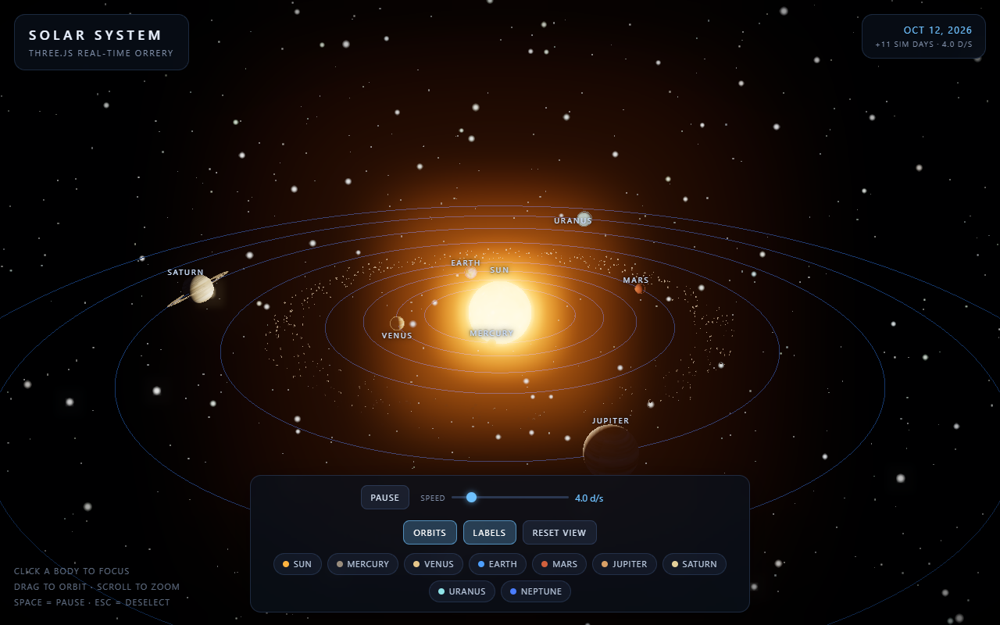
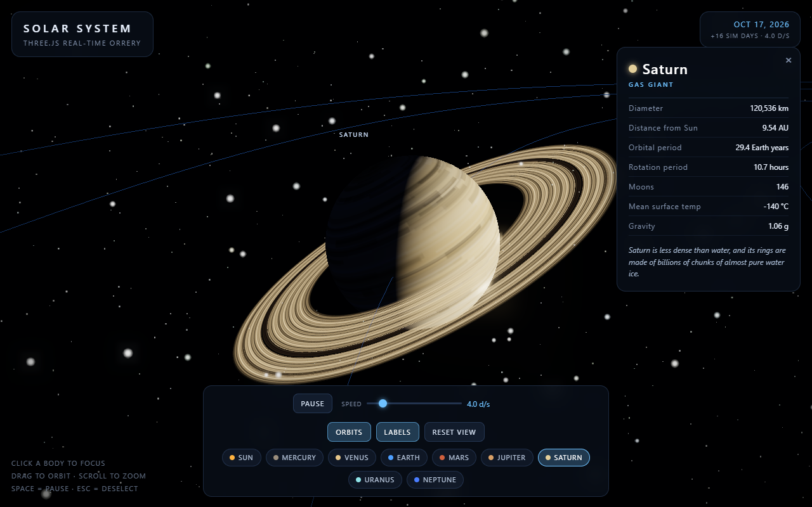

# Solar System — Three.js

A web-based, real-time 3D orrery of the solar system built with [Three.js](https://threejs.org/). Everything — planets, rings, clouds, stars — is generated procedurally in the browser, so the repo ships with zero image assets.





## Features

- **All 8 planets + the Sun** on their own orbits, with axial tilts, spin rates and orbital periods modelled after the real system
- **Procedural textures** drawn to `<canvas>` at load time: banded gas giants (including Jupiter's Great Red Spot), cratered rocky worlds, Earth's continents and ice caps, Saturn's ring system with the Cassini division
- **Earth extras** — animated cloud layer, atmospheric rim glow, and an orbiting Moon
- **Saturn's rings** with custom geometry UVs so ring banding maps radially
- **800-asteroid instanced belt** between Mars and Jupiter
- **Post-processing** — HDR sun corona (3-layer sprite glow) with `UnrealBloomPass` and ACES tone mapping
- **Starfield** of ~6 000 additive point sprites in two depth layers
- **Click-to-focus camera** that flies to a body, follows it in orbit, and opens a data panel with real figures
- **Time controls** — pause and a 0–30 days/second speed slider, with a live simulated-date clock

## Quick start

Requires Node.js 18+.

```bash
npm install
npm start
```

Then open **http://localhost:8080**.

> `npm start` runs `server.js`, a ~40-line zero-dependency static file server. Any other static server works too, e.g. `npx serve .` — but the ES-module import map resolves Three.js from `./node_modules`, so `npm install` must run first.

## Controls

| Input | Action |
| --- | --- |
| Click a planet / Sun / Moon | Focus camera and open the info panel |
| Click a chip in the bottom bar | Jump to that body |
| Drag | Orbit the camera |
| Scroll | Zoom |
| `Space` | Pause / resume |
| `Esc` | Deselect |
| `R` | Reset view |
| `O` | Toggle orbit lines |
| `L` | Toggle labels |

UI buttons also expose pause, speed, orbits, labels and reset.

## Project structure

```
index.html          markup, styling, import map (maps "three" → node_modules)
src/main.js         scene setup, body data, camera focus logic, render loop
src/textures.js     procedural canvas texture generators
server.js           minimal static file server
docs/               screenshots
```

### How it works

- Bodies are positioned each frame from `simDays`, a simulated day counter advanced by `delta × speed`. Orbital angles use a compressed period table so outer planets remain watchable while keeping the correct ordering and real relative motion.
- The Sun is a `MeshBasicMaterial` with an over-driven colour (`color.setRGB(3.0, 2.3, 1.5)`) so its pixels sit above the bloom threshold; the rest of the scene is lit by a single decay-free `PointLight`.
- Focus works by lerping `OrbitControls.target` and the camera together, then re-offsetting both by the body's world-position delta every frame so the planet stays centred while you keep full orbit/zoom control.
- Labels use `CSS2DRenderer` (DOM overlay), so they stay crisp at any zoom.

## Tech

- [three.js](https://threejs.org/) r169 (ES modules, no bundler, no build step)
- `OrbitControls`, `CSS2DRenderer`, `EffectComposer`, `UnrealBloomPass`, `OutputPass`
- Plain HTML/CSS UI, vanilla JS

## License

MIT
